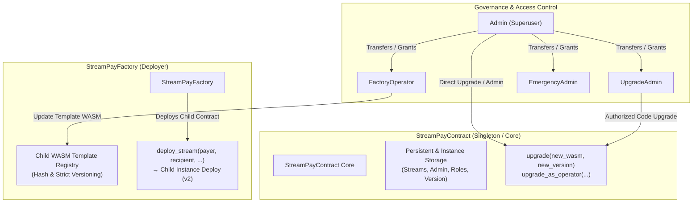

# StreamPay Upgradeability & Factory Control Architecture

**Issue:** #154 — Restrict factory and upgrade controls  
**Status:** Implemented  
**Scope:** `StreamPayContract`, `StreamPayFactory`, Role-Based Access Control (RBAC), Version Compatibility, Control-Plane Events, and Migration State Preservation.

---

## 1. Executive Summary

StreamPay smart contracts implement explicit, restricted upgrade controls and a role-governed factory deployer. Upgrades and administrative actions require cryptographic authorization, strictly monotonic version increments, full state backward compatibility, and control-plane event emissions for auditability and indexing.



---

## 2. Role-Based Access Control (RBAC)

Access control is structured around the `Role` enumeration:

```rust
#[contracttype]
#[derive(Clone, Copy, Debug, Eq, PartialEq)]
pub enum Role {
    Admin = 0,
    UpgradeAdmin = 1,
    FactoryOperator = 2,
    EmergencyAdmin = 3,
}
```

### 2.1 Role Responsibilities

| Role | Numerical ID | Privileges |
|---|---|---|
| **Admin** | `0` | Superuser. Can initialize, transfer admin ownership, grant/revoke all roles, update contract code, and update factory WASM templates. Implicitly possesses all roles. |
| **UpgradeAdmin** | `1` | Delegated operator permitted to invoke `upgrade_as_operator` on `StreamPayContract` with strictly increasing version checks. |
| **FactoryOperator** | `2` | Delegated operator permitted to update the child contract template WASM hash and version on `StreamPayFactory` via `set_wasm_hash_as_operator`. |
| **EmergencyAdmin** | `3` | Reserved for circuit-breaking or emergency parameter intervention. |

### 2.2 Privilege Rules & Constraints

1. **One-Time Initialization**: `initialize(admin)` can only be called once. Any subsequent call panics with `"already initialized"` (or `"factory already initialized"`).
2. **Admin Transfer**: Only the current admin can call `set_admin(new_admin)`. The new admin address must differ from the current admin (`panic!("new admin must be different")`). Transfer automatically grants all roles to `new_admin` and revokes `Role::Admin` from `old_admin`.
3. **Role Grants & Revocations**: Only the current admin can grant or revoke roles via `grant_role(role, account)` and `revoke_role(role, account)`.
4. **Implicit Admin Rights**: When `has_role(role, account)` is queried, if `account == admin`, it returns `true` for all roles.

---

## 3. Versioning Invariants & Upgrade Controls

### 3.1 Version Encoding Scheme

Versions are stored and validated as 32-bit integers conforming to Semantic Versioning:
$$\text{version} = \text{major} \times 1\,000\,000 + \text{minor} \times 1\,000 + \text{patch}$$

* Current baseline: `0.2.0` $\rightarrow$ `2_000` (`VERSION`).

### 3.2 Upgrade Invariants

Both `StreamPayContract::upgrade` and `StreamPayFactory::upgrade` enforce strict monotonic increases:
$$\text{new\_version} > \text{current\_version}$$

* **Downgrade Protection**: Any attempt to provide $\text{new\_version} < \text{current\_version}$ immediately panics (`"new version must be strictly greater than current version"`).
* **Replay & No-Op Protection**: Any attempt to provide $\text{new\_version} == \text{current\_version}$ immediately panics.
* **WASM Host Dispatch**: Calls `env.deployer().update_current_contract_wasm(new_wasm_hash)`.

---

## 4. Factory Architecture & Template Management

`StreamPayFactory` provides controlled deployment and tracking of child stream contracts.

### 4.1 Child WASM Template Versioning

* The factory holds the official child contract WASM hash (`f_wasm`) and template version (`f_tmpl_ver`).
* When updating the template WASM hash via `set_wasm_hash` (admin) or `set_wasm_hash_as_operator` (operator with `Role::FactoryOperator`):
  * The caller's authorization is verified (`require_auth`).
  * The new template version must satisfy $\text{new\_template\_version} > \text{current\_template\_version}$.
  * The factory records the update and emits `WasmTemplateUpdatedEvent`.

### 4.2 Stream Deployment

* Streams deployed via `deploy_stream(payer, recipient, rate_per_second, initial_balance, end_time, salt)`:
  * Validate non-negative and positive rates and balances (`rate > 0`, `initial_balance > 0`).
  * Instantiate child contract via Soroban `deploy_v2` with deterministic address generation derived from `salt`.
  * Increment factory `next_stream_id` and register child contract address in persistent storage (`f_stream`, `stream_id`).
  * Emit `StreamDeployedEvent` indexing `stream_id`.

---

## 5. Deployed State & Migration Compatibility

To ensure zero downtime and complete state preservation across contract upgrades:

1. **Storage Decoupling**: Stream records (`StreamInfo`) reside in persistent storage under keys `("stream", stream_id)`. Administrative metadata resides in instance storage under keys `"admin"`, `("role", role, account)`, and `"version"`.
2. **Uninitialized Contract Compatibility**: If a contract is deployed without an immediate admin initialization, existing stream creation, settlement, pausing, resumption, and cancellation continue to function identically with zero breaking changes.
3. **Continuous Accrual & Settle**: Upgrading code or transferring admin roles mid-lifecycle does not alter existing stream balances, timestamps, or settlement mathematics.

---

## 6. Control-Plane Events

All control-plane transitions publish indexed Soroban events:

| Event Discriminator | Topics | Payload Struct | Description |
|---|---|---|---|
| `"admin_initialized"` | `("admin_initialized", "admin")` | `AdminInitializedEvent { admin }` | Emitted when contract/factory admin is initialized. |
| `"admin_transferred"` | `("admin_transferred", "admin")` | `AdminTransferredEvent { old_admin, new_admin }` | Emitted when administrative ownership is transferred. |
| `"role_granted"` | `("role_granted", role_u32)` | `RoleGrantedEvent { role, account, granter }` | Emitted when an RBAC role is granted to an account. |
| `"role_revoked"` | `("role_revoked", role_u32)` | `RoleRevokedEvent { role, account, revoker }` | Emitted when an RBAC role is revoked from an account. |
| `"contract_upgraded"` | `("contract_upgraded", new_version)` | `ContractUpgradedEvent { old_version, new_version, new_wasm_hash }` | Emitted upon successful contract code upgrade. |
| `"wasm_template_updated"` | `("wasm_template_updated", new_version)` | `WasmTemplateUpdatedEvent { old_wasm_hash, new_wasm_hash, old_version, new_version, updater }` | Emitted when factory child WASM template is updated. |
| `"stream_deployed"` | `("stream_deployed", stream_id)` | `StreamDeployedEvent { stream_id, contract_address, payer, recipient, rate_per_second, initial_balance, end_time }` | Emitted when a child stream contract is deployed. |

---

## 7. Verification & Test Suite

The test suite in [`tests/issue154_factory_upgrade_controls.rs`](file:///Users/solveetcoagula/Desktop/activeProjects/bounty_operations/StreamPay-Contracts_154/tests/issue154_factory_upgrade_controls.rs) covers:

1. **Authorization & RBAC**:
   - Unauthorized attempts to set admin, grant roles, revoke roles, or upgrade code fail authentication.
   - Admin transfer updates ownership and permissions while revoking old admin rights.
   - Role lifecycle (grant, verify, revoke, verify) functions accurately.
2. **Version Transitions**:
   - Replay/same-version upgrades panic with descriptive errors.
   - Downgrade attempts panic with descriptive errors.
   - Strictly increasing versions are accepted.
3. **State Preservation**:
   - Streams started before admin initialization remain readable and settleable across admin transfer and role changes.
4. **Factory Lifecycle**:
   - Factory initialization, double-initialization rejection, operator template updates, invalid rate/balance deployment panics, and child registry indexing.
